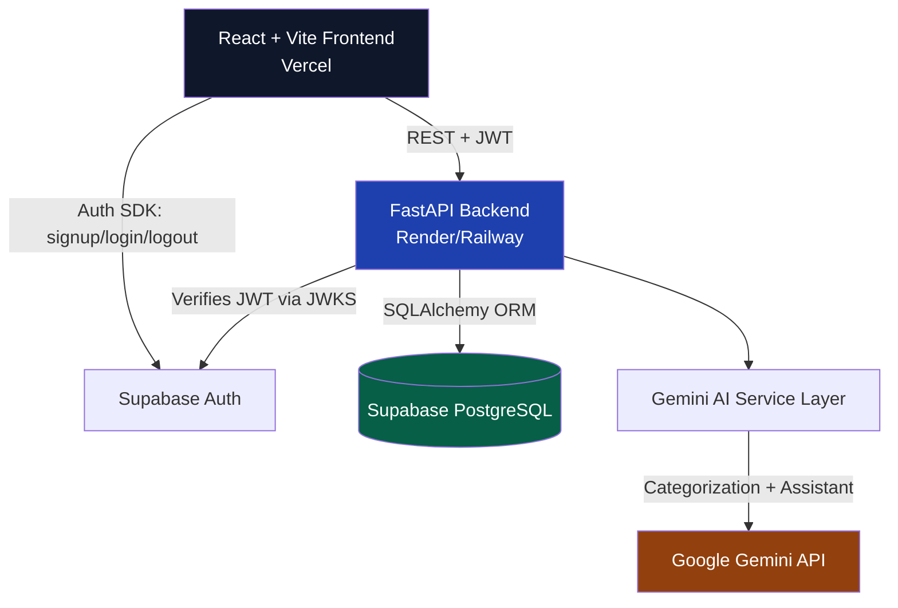

# PocketWise

A production-quality, student-focused personal finance and budget management platform. Built incrementally across 12 phases as a portfolio project.

> **Track → Analyze → Predict → Improve**

PocketWise isn't a basic expense tracker — it answers the questions students actually have: *Where did my money go? Can I afford this? Will my money last until my next allowance? Am I on track toward my goals?*

---

## Table of Contents

- [Problem Statement](#problem-statement)
- [Features](#features)
- [Architecture](#architecture)
- [Tech Stack](#tech-stack)
- [Database Schema](#database-schema)
- [API Reference](#api-reference)
- [Getting Started](#getting-started)
- [Environment Variables](#environment-variables)
- [Running Tests](#running-tests)
- [Deployment](#deployment)
- [Security](#security)
- [Future Improvements](#future-improvements)

---

## Problem Statement

Most student budget apps are either too simple (a bare expense log with no insight) or too complex (built for households managing mortgages and multiple bank accounts). Students have a distinct financial pattern: irregular income (pocket money, stipends, scholarships), a hard "days until next allowance" constraint, and a need to balance social spending against savings goals — without the overhead of enterprise personal-finance tools.

PocketWise is built specifically around that pattern.

## Features

### Core (Phases 1–3)
- Supabase Auth: signup, login, logout, password reset, protected routes
- Income tracking (pocket money, stipends, scholarships, gifts, recurring or one-time)
- Expense tracking with category, payment method, need/want tagging
- Full transaction history: search, filter, sort
- Dashboard: balance, income, expenses, savings, category/monthly spending charts
- Category budgets with warning levels (normal / warning / critical / overspent)
- Daily spending limit recommendation

### Student Intelligence (Phases 4–5)
- Savings goals with weekly/monthly pacing ("save ₹700/week to hit this by Oct 15")
- Recurring expenses with due-date tracking and one-click "mark paid" (auto-logs a transaction, advances the schedule)
- Split expenses — track who owes you and who you owe, per person
- Needs vs. Wants breakdown
- Real-time overspending alerts and week-over-week spending change alerts
- Student-specific insights (e.g. "Hostel expenses are 32% of your monthly spending")

### Advanced / AI (Phases 6–9)
- Deterministic 0–100 Financial Health Score (savings rate, budget adherence, wants ratio, spending consistency, goal progress) with plain-English strengths/weaknesses
- No-spend day tracking with longest-streak calculation
- Monthly Financial Report page
- Gemini-powered natural-language expense categorization ("Bought pizza for ₹450" → Food / Want / ₹450)
- AI financial assistant chat, grounded in your real (aggregated, non-sensitive) financial data
- "Can I Afford This?" — weighs balance, upcoming bills, budget impact, and goal delay before answering
- Explainable (non-ML) spending prediction: projected month-end total per category
- 5-badge achievement system (First Saver, 7-Day Streak, Money Saver, No-Spend Day, Goal Crusher)

### Polish & Hardening (Phases 10–11)
- Dark/light mode with persisted preference
- Mobile-responsive navigation (hamburger menu)
- Skeleton loading states
- 124 backend tests (unit + real API integration tests + auth edge cases) and 10 frontend tests
- Per-IP rate limiting, stricter on AI endpoints
- Full Row Level Security on every Supabase table

## Screenshots

*(Add screenshots here once you have a deployed instance — dashboard, transactions, AI assistant, and achievements pages are the most visually representative.)*

## Architecture



**Key architectural decisions:**
- The frontend authenticates directly against Supabase Auth (industry-standard pattern) and only ever sends the resulting JWT to the backend — the backend never sees a password.
- The backend verifies JWTs against Supabase's public JWKS endpoint, supporting both current asymmetric (ES256/RS256) and legacy (HS256) signing.
- The AI layer (`services/ai/`) is fully isolated behind `gemini_client.py` — swapping providers means changing one file. Every AI feature degrades gracefully (returns `None`/a fallback message) if the API key is missing or the call fails; the core app never depends on AI being available.
- All financial calculations (health score, budget status, predictions, affordability) are pure, deterministic, unit-tested functions — never AI-generated numbers.

## Tech Stack

| Layer | Technology |
|---|---|
| Frontend | React, Vite, Tailwind CSS, React Router, Recharts, Lucide Icons |
| Backend | Python, FastAPI, Pydantic, SQLAlchemy |
| Database & Auth | PostgreSQL + Auth via Supabase |
| AI | Google Gemini API (`gemini-3.6-flash`), swappable provider layer |
| Testing | Pytest (backend), Vitest (frontend) |
| Rate limiting | slowapi |
| Deployment | Vercel (frontend), Render/Railway (backend), Supabase (database) |

## Database Schema

```
profiles              -- extends Supabase auth.users with app-specific fields
income                -- user income entries (recurring or one-time)
transactions           -- expenses: category, payment method, need/want
budgets                -- per-category monthly spending limits
savings_goals          -- target amount, deadline, priority
recurring_expenses     -- subscriptions/bills with next_due_date
split_expenses         -- group expenses
  └── split_participants -- who owes what, per split
achievements           -- fixed catalog (seeded automatically on backend startup)
  └── user_achievements -- which badges each user has earned
```

Every table has Row Level Security enabled — a user can only read/write rows where `user_id = auth.uid()`. Full `CREATE TABLE` + policy definitions are in `phase1_setup.sql` through `phase4_setup.sql` and `phase9_setup.sql` at the project root — run all of them in order in your Supabase SQL Editor before first use.

## API Reference

All routes except `/health` require `Authorization: Bearer <supabase-jwt>`.

| Resource | Endpoints |
|---|---|
| Auth/Profile | `GET/PUT /me` |
| Income | `GET/POST /income`, `PUT/DELETE /income/{id}` |
| Transactions | `GET/POST /transactions`, `GET/PUT/DELETE /transactions/{id}` (search/filter/sort via query params) |
| Budgets | `GET/POST /budgets`, `PUT/DELETE /budgets/{id}` |
| Dashboard | `GET /dashboard` (the big one — overview, charts, health score, insights, no-spend days) |
| Goals | `GET/POST /goals`, `PUT/DELETE /goals/{id}`, `POST /goals/{id}/contribute` |
| Recurring | `GET/POST /recurring-expenses`, `PUT/DELETE /recurring-expenses/{id}`, `POST /recurring-expenses/{id}/mark-paid` |
| Splits | `GET/POST /split-expenses`, `DELETE /split-expenses/{id}`, `PUT /split-expenses/{id}/participants/{id}/mark-paid` |
| Reports | `GET /reports/monthly` |
| AI | `POST /ai/categorize-expense`, `POST /ai/assistant`, `POST /ai/affordability-check` |
| Predictions | `GET /predictions` |
| Achievements | `GET /achievements` |

Full request/response schemas are viewable live at `http://localhost:8000/docs` (FastAPI's auto-generated Swagger UI) once the backend is running.

## Getting Started

### Prerequisites
- Python 3.11 or 3.12 (**not 3.14** — pydantic-core has no prebuilt wheels for it yet on Windows)
- Node.js 18+
- A Supabase project (free tier is enough)
- A Gemini API key (optional — the app works fully without it, just without AI features)

### 1. Supabase setup
Run every `phase*_setup.sql` file at the project root, in order (1 → 9), in your Supabase project's SQL Editor.

### 2. Backend
```bash
cd backend
python -m venv venv
source venv/bin/activate        # Windows: venv\Scripts\activate
pip install -r requirements.txt
cp .env.example .env            # fill in your Supabase + Gemini values
uvicorn app.main:app --reload --port 8000
```
Visit `http://localhost:8000/health` — should return `{"status": "ok"}`.

### 3. Frontend
```bash
cd frontend
npm install
cp .env.example .env            # fill in your Supabase URL + anon key
npm run dev
```
Visit `http://localhost:5173`.

## Environment Variables

**backend/.env**

| Variable | Where to get it |
|---|---|
| `SUPABASE_URL` | Project Settings → API |
| `SUPABASE_ANON_KEY` | Project Settings → API |
| `SUPABASE_JWT_SECRET` | Project Settings → API → JWT Settings (legacy HS256 projects only — modern projects verify via JWKS automatically) |
| `DATABASE_URL` | Project Settings → Database → Connection string |
| `FRONTEND_ORIGIN` | `http://localhost:5173` locally; comma-separate to add your deployed URL |
| `GEMINI_API_KEY` | [Google AI Studio](https://aistudio.google.com) → Get API key (free tier available) |
| `GEMINI_MODEL` | Defaults to `gemini-3.6-flash` — check Google AI Studio for the current model lineup, as model names get deprecated periodically |

**frontend/.env**

| Variable | Value |
|---|---|
| `VITE_SUPABASE_URL` | Same as backend |
| `VITE_SUPABASE_ANON_KEY` | Same as backend — the anon key is meant to be public, protected by RLS |
| `VITE_API_BASE_URL` | `http://localhost:8000` locally; your deployed backend URL in production |

## Running Tests

```bash
# Backend (124 tests)
cd backend
pytest tests/

# Frontend (10 tests)
cd frontend
npm run test
```

See `PHASE10_SECURITY.md` for what's covered (auth edge cases, cross-user data isolation, rate limiting) and known gaps.

## Deployment

### Database — Supabase
Already done if you followed Getting Started. Nothing further needed.

### Backend — Render or Railway
1. Push this repo to GitHub.
2. Create a new Web Service, root directory `backend/`.
3. Build command: `pip install -r requirements.txt`
4. Start command: `uvicorn app.main:app --host 0.0.0.0 --port $PORT` (also provided as `backend/Procfile` for platforms that read it automatically)
5. Add all the environment variables from `backend/.env` in the platform's dashboard — **never commit `.env`**.
6. Once deployed, note the backend's public URL.

### Frontend — Vercel
1. Import the repo, set root directory to `frontend/`.
2. Vercel auto-detects Vite — build command `npm run build`, output directory `dist`.
3. `frontend/vercel.json` is already included with a SPA rewrite rule (required for React Router — without it, refreshing on any page other than `/` would 404 in production).
4. Add the three `VITE_*` environment variables in Vercel's dashboard, with `VITE_API_BASE_URL` pointing at your deployed backend.

### After both are deployed
Update `FRONTEND_ORIGIN` in your backend's environment variables to include your Vercel URL (comma-separated with `localhost:5173` if you still want local dev to work against the deployed backend).

## Security

See `PHASE10_SECURITY.md` for the full checklist. Summary: JWT auth verified via JWKS, every query scoped to `user_id` (tested explicitly for cross-user isolation), Pydantic input validation throughout, zero raw SQL (ORM-only, no injection surface), CORS locked to known origins, no secrets in frontend code, per-IP rate limiting on all routes with tighter limits on AI endpoints.

## Future Improvements

Honest gaps, not hidden:
- **Alembic migrations** — schema changes currently rely on SQLAlchemy's `create_all`, which only adds new tables and never alters existing ones. Fine for this project's pace; a real production app should migrate to Alembic.
- **Redis-backed rate limiting** — current limiter is in-memory per-process; would need a shared backend if this ever runs across multiple server instances.
- **Hostel Mode sub-categories** — the original spec sketched a dedicated hostel/mess/laundry/electricity breakdown; this was folded into the general category system plus automatic "student insights" instead, to avoid duplicating the budget system with a second parallel one.
- **Explicit Emergency Fund tracking** — currently, "savings" is simply unspent balance; a dedicated reserve amount you can't accidentally count as spendable would need its own field and dashboard treatment.
- **Recurring-expense-to-transaction linkage** — "Mark paid" creates an independent transaction; deleting the recurring expense doesn't retroactively delete transactions it already generated. A linked foreign key would allow bulk cleanup.
- **Audit logging** — no history of who changed what when, beyond normal server request logs.
